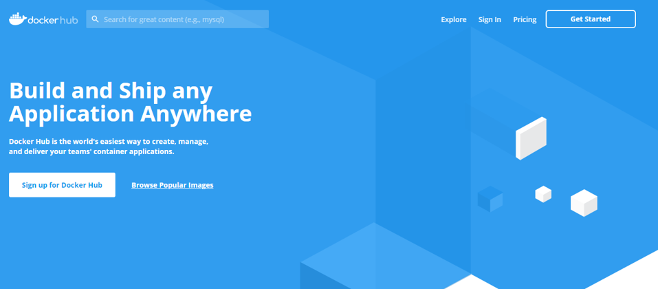

# 도커 레지스트리


도커헙는 도커 이미지 원격 저장소입니다. 사용자들은 도커헙에 이미지를 업로드하고 다른 곳에서 자유롭게 재사용할 수 있습니다. 깃헙과 마찬가지로 퍼블릭 저장소는 무료로, 프라이빗 저장소에 대해서는 비용을 받습니다.

## 도커허브 계정 만들기

도커허브에 접속하여 (https://hub.docker.com/) 계정을 생성합니다.

*실습에서 <USERNAME> 위치에 각자의 도커허브 계정 이름을 입력합니다.*




그리고 난 후 nginx 레포지토리를 생성합니다. `Create Repository` > `Name` 에 nginx라고 기입합니다. > `Create`


### 이미지 tag 달기

이미지에서 새로운 이름을 부여할 수 있습니다. nginx 이미지에 새로운 이름 `<USERNAME>/nginx`를 달아(tag) 봅시다.

```bash
docker tag nginx <USERNAME>/nginx
```

### 이미지 버전 달기

tag를 부여할 때, 버전명도 함께 부여할 수 있습니다. nginx 이름에 새로운 이미지 `<USERNAME>/nginx:1` 이름 부여

```bash
docker tag nginx <USERNAME>/nginx:1
```

생략 시 `latest`가 입력됩니다.

### 이미지 확인

생성된 이미지 리스트를 확인합니다. 지금까지 사용하고 생성한 이미지 리스트가 보입니다.

```bash
docker images
# REPOSITORY          TAG                 IMAGE ID            CREATED              SIZE
# nginx               wget                e6a274cc5af1        About a minute ago   152MB
# nginx               curl                89b0e8f41524        2 minutes ago        150MB
# ubuntu              16.04               330ae480cb85        8 days ago           125MB
# ubuntu              latest              74435f89ab78        8 days ago           73.9MB
# ubuntu              18.04               8e4ce0a6ce69        8 days ago           64.2MB
# hongkunyoo/nginx    1                   2622e6cca7eb        2 weeks ago          132MB
# hongkunyoo/nginx    latest              2622e6cca7eb        2 weeks ago          132MB
# nginx               latest              2622e6cca7eb        2 weeks ago          132MB
# docker/whalesay     latest              6b362a9f73eb        5 years ago          247MB
```

*nginx:latest와 <USERNAME>/nginx:latest 이미지가 같은 IMAGE_ID를 가지고 있는 것을 확인해 보세요*


### 도커헙 로그인

도커헙에서 생성한 계정과 비밀번호를 입력하세요.

```bash
docker login
# Username: 
# Password: 
# WARNING! Your password will be stored unencrypted in /home/ubuntu/.docker/config.json.
# Configure a credential helper to remove this warning. See
# https://docs.docker.com/engine/reference/commandline/login/#credentials-store
# 
# Login Succeeded
```

### 이미지 업로드

이제 이미지를 업로드합니다.

```bash
docker push <USERNAME>/nginx
# The push refers to repository [docker.io/hongkunyoo/nginx]
# f978b9ed3f26: Preparing
# 9040af41bb66: Preparing
```


### 이미지 다운로드

반대로 다음과 같이 이미지를 다운로드 합니다. 이미 이미지가 로컬에 있기에 다시 다운로드 받지 않고 금방 끝납니다.

```bash
docker pull <USERNAME>/nginx
```

이번에는 `redis` 이미지를 다운로드 받아 보겠습니다.

```bash
docker pull redis
# Using default tag: latest
# latest: Pulling from library/redis
# 8559a31e96f4: Already exists
# 85a6a5c53ff0: Pull complete

docker images
```

### 이미지 삭제

도커헙에 있는 이미지가 아닌, 로컬 서버에 있는 이미지를 삭제합니다.

```bash
docker rmi <USERNAME>/nginx

docker images
```

이미지 삭제 후, 도커헙에서 다시 이미지를 다운 받을 수 있습니다.

```bash
docker pull <USERNAME>/nginx

docker images
```

---

## :trophy: Do it more #1

도커헙에서 젠킨스 이미지를 찾아 README 설명에 맞게 젠킨스를 구동해 봅시다.

## :trophy: Do it more #2

ubuntu 호스트에서 CentOS 컨테이너를 사용해 봅니다. 

1. `cat /etc/os-release`에 결과를 확인해 봅시다.
2. CentOS에 yum을 이용하여 python을 설치해 봅시다.
3. CentOS에 yum을 이용하여 nginx를 설치해 봅시다.
