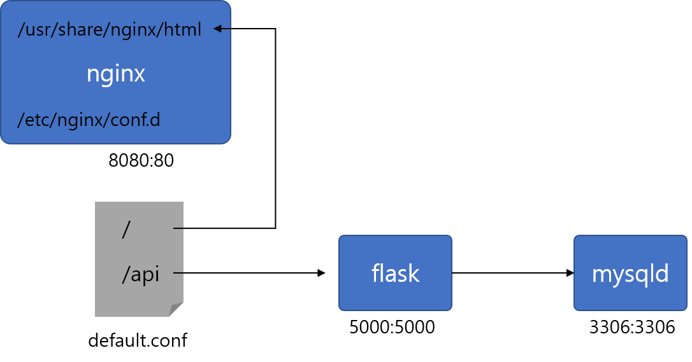

# docker 실행 고급

도커 실행시 몇가지 옵션들을 조금 더 소개합니다.

#### 1. Network

지금까지 nginx 실행시, 컨테이너 내부에서 동작을 확인하였습니다. (`curl localhost`) 이것을 로컬 서버 포트와 연결시켜 실행해 보도록 하겠습니다.

```bash
# docker run -p $HOST_PORT:$CONTAINER_PORT $IMG
# 호스트의 5000번 포트를 컨테이너의 80포트와 매핑합니다.
docker run -p 5000:80 nginx
# /docker-entrypoint.sh: /docker-entrypoint.d/ is not empty, will attempt to perform configuration
# /docker-entrypoint.sh: Looking for shell scripts in /docker-entrypoint.d/
# /docker-entrypoint.sh: Launching /docker-entrypoint.d/10-listen-on-ipv6-by-default.sh
# 10-listen-on-ipv6-by-default.sh: Getting the checksum of /etc/nginx/conf.d/default.conf
# 10-listen-on-ipv6-by-default.sh: Enabled listen on IPv6 in /etc/nginx/conf.d/default.conf
# /docker-entrypoint.sh: Launching /docker-entrypoint.d/20-envsubst-on-templates.sh
# /docker-entrypoint.sh: Configuration complete; ready for start up
```

> 종료: <CTRL> + <C>

다시 백그라운드로 실행합니다. (`-d` 옵션)

```bash
docker run -p 5000:80 -d nginx

# 내부 IP로 접근 시
ifconfig 
# 외부 IP로 접근 시
curl ifconfig.co

# 5000번으로 curl 호출을 합니다.
curl <내부 혹은 외부IP>:5000
```

이번에는 내부 혹은 외부 IP를 이용하여 직접 웹 브라우저에 입력합니다.

> 웹 브라우저 URL: `$IP:5000`

이를 통해 외부 트레픽을 컨테이너 내부까지 전달할 수 있게 됩니다.

#### 2. Volume

이미지 실행시, 네트워크 연결뿐만 아니라 로컬의 파일시스템을 컨테이너와 연결할 수 있습니다.

```bash
# docker run -v $HOST_DIR:$CONTAINER_DIR $IMG
# 현재 디렉토리를 컨테이너의 nginx 디렉토리와 연결합니다.
docker run -p 6000:80 -v $(pwd):/usr/share/nginx/html/ -d nginx

# 현재 디렉토리에 hello.txt 파일을 생성합니다.
echo hello! >> $(pwd)/hello.txt
# nginx 내부에서 해당 파일이 보이는지 확인합니다.
curl <내부 혹은 외부IP>:6000/hello.txt
# hello!
```

변경 사항이 많은 파일의 경우, 컨테이너 내부에 파일을 두지 않고 호스트 서버의 디렉토리를 연결하여, 호스트 서버에서 조금 더 손쉽게 파일을 수정할 수 있습니다. 또한 컨테이너는 컨테이너 종료시, 저장된 데이터가 사라지지만 볼륨을 이용하여 데이터를 저장하는 경우 데이터가 유실되지 않고 유지되는 장점이 있습니다.

#### 3. entrypoint

앞서 `ENTRYPOINT`는 파라미터 전달시 override 되지 않는다고 설명하였지만 `--entrypoint`라는 옵션으로 `ENTRYPOINT`를 강제로 override하는 방법이 있습니다.

```Dockerfile
FROM ubuntu:18.04

ENTRYPOINT ["echo"]
```

```bash
docker build . -t lets-echo

docker run lets-echo hello
# hello

# ls의 결과가 출력되는 것을 기대하나 ls '/etc/passwd' 라는 문자열이 출력됨
docker run lets-echo ls /etc/password
# ls /etc/password

# entrypoint를 ls로 override
docker run --entrypoint=ls lets-echo /etc/passwd
# /etc/passwd
```

#### 4. User

이번에는 Dockerfile의 `USER` 지시자에 대해서 살펴보고 이를 override하는 방법을 알아보겠습니다.

기본적으로 컨테이너의 유저는 root입니다. 하지만 보안상의 이유로 root가 아닌 일반 유저를 사용하도록 만들 수 있습니다.

```Dockerfile
FROM ubuntu:18.04

# Ubuntu 유저 생성
RUN adduser --disabled-password --gecos "" ubuntu

# 컨테이너 실행시 ubuntu로 실행
USER ubuntu
```

```bash
# my-user 라는 이미지 생성
docker build . -t my-user

# ubuntu라는 유저로 컨테이너 실행
docker run -it my-user bash
# ubuntu@b09ce82d4a77:/$

ubuntu@b09ce82d4a77:/$ apt update
# Reading package lists... Done
# E: List directory /var/lib/apt/lists/partial is missing. - Acquire (13: Permission denied)
```

ubuntu는 root 유저가 아니기 때문에 root 권한이 필요한 `apt` 사용하게 되면 퍼미션 에러가 발생합니다. 하지만 도커를 실행시 `--user` 옵션을 이용하여 명시적으로 유저를 입력할 수 있습니다.

```bash
# 강제로 root 유저 사용
docker run --user root -it my-user bash
root@0ac2522215e8:/# apt update
# Get:1 http://security.ubuntu.com/ubuntu bionic-security InRelease [88.7 kB]
# Get:2 http://archive.ubuntu.com/ubuntu bionic InRelease [242 kB]
# ...
```

#### Clean up

```bash
docker stop $(docker ps -aq)
docker rm $(docker ps -aq)
```

---

## :trophy: Do it more #1

1. nginx 컨테이너를 2개 생성합니다. 각각 5000, 5010 포트를 컨테이너 내부 80포트에 바인딩합니다.
2. 두개 컨테이너는 동일하게 호스트의 `~/html` 디렉토리와 컨테이너 내부 `/usr/share/nginx/html/`를 볼룸 연결합니다.
3. 웹 브라우저에서 `$HOST_IP:5000`과 `$HOST_IP:5010`가 정상적으로 나오는지 확인합니다.


---

## :trophy: Do it more #2

간단한 어플리케이션을 만들고자 합니다. 어플리케이션의 이름은 `my-simple-app`입니다.

`my-simple-app`은 다음과 같은 구조를 가집니다.
- nginx web
  - port: 8080
  - volume
  	- /usr/share/nginx/html/: html파일 위치
  	- /etc/nginx/conf.d/    : nginx 설정파일 위치

- flask app
  - port: 5000
  - env:
  	- MYSQL_HOST: 내부 혹은 외부 IP
    - MYSQL_USER: mysql 유저명
    - MYSQL_PASSWORD: mysql 비밀번호
- mysql db
 - port: 3306
 - env:
   - MYSQL_ROOT_PASSWORD: Root 비밀번호 설정
   - MYSQL_USER: User 이름 설정
   - MYSQL_PASSWORD: User 비밀번호 설정



#### 디렉토리 구조 설명
- Dockerfile: flask app을 만들기 위한 도커파일
- app.py: flask app에서 실제 실행되는 스크립트
- conf/: nginx 설정 파일이 저장되어 있는 폴더
- html/: index.html 파일이 저장되어 있는 폴더


#### conf/default.conf 설정
```bash
# 먼저 나의 내부 IP를 가져옵니다. ifconfig
export MY_IP=<my private ip>

# default.conf 파일 안에 $MY_IP를 실제 IP로 변경해 줍니다.
sed "s/\$MY_IP/$MY_IP/g" conf/default.conf > conf/default.conf
```

#### 컨테이너 구조

```bash
# 아래 도커 명령을 기초로 적절하게 수정하여 어플리케이션을 완성하세요.
# nginx 실행
docker run nginx
# flask 빌드
docker build . -t flask
# flask 실행
docker run flask
# mysql 서버 실행
docker run mysql
```

---


## :trophy: Do it more #3

다음 공식 이미지를 참고하여 아래 어플리케이션들을 생성해 봅시다.

> https://hub.docker.com/search?image_filter=official&type=image

- 주피터 노트북 생성: https://jupyter-docker-stacks.readthedocs.io/en/latest/
- Redis 생성: https://registry.hub.docker.com/_/redis
- 파이썬 버전 변경: https://hub.docker.com/_/python

