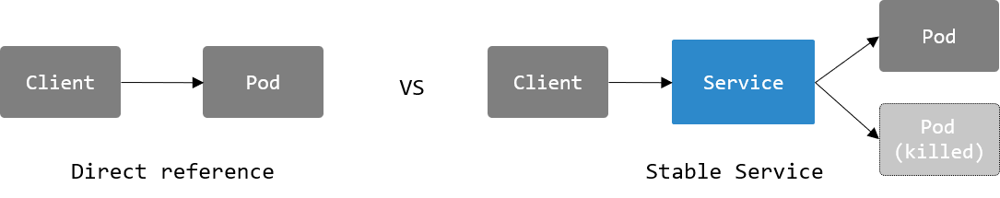
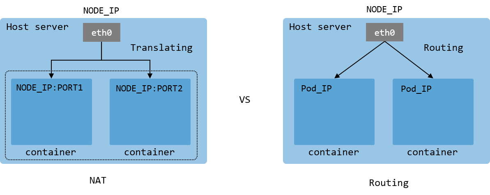

# 쿠버네티스 네트워킹

지금까지 쿠버네티스의 가장 기본이 되는 `Pod`에 대해서 살펴 보았고 이제 쿠버네티스의 네트워크를 담당하는 `Service` 리소스에 대해서 설명하도록 하겠습니다.
`Service` 리소스도 `Pod`와 YAML 형식으로 정의됩니다. `Service`를 도커와 비교해 본다면 `docker run` 명령 실행시 호스트 서버의 포트를 매핑하는 부분이라고 이해하시면 좋습니다.
단지 쿠버네티스의 네트워크는 훨씬 더 기능이 많고 강력하기 때문에 `run` 명령과 분리되어 독자적으로 `Service`라는 리소스를 가지게 되었습니다.

## Pod IP와 Service
쿠버네티스에는 `Pod` 자체에도 IP가 부여됩니다. `curl` 명령을 통해 Pod IP로 호출을 하면 정상적으로 결과를 반환합니다. 그렇다면 쿠버네티스에는 `Service`라는 리소스를 따로 만들게 되었을까요?

```bash
kubectl get pod -owide
# NAME        READY   STATUS     RESTARTS   AGE   IP           NODE    NOMINATED NODE   READINESS GATES
# mynginx     1/1     Running    0          12d   10.42.0.26   xxxxx   <none>           <none>

kubectl run mycurl --image curlimages/curl --restart Never -- curl 10.42.0.26
# <html>
# NGINX page
# ...
```

### ephemeral `Pod` vs stable `Service`
`Pod`라는 리소스는 쿠버네티스에서 단명하는 (ephemeral) 자원입니다. 필요한 경우 쉽게 생성하였다가 사용이 끝나면 쉽게 삭제할 수 있는 리소스입니다. 이러한 사용성 때문에 `Pod` 자체의 IP를 사용하게 되면 클라이언트 입장에서는 광징히 불안정한 백엔드를 가지게 되어 매 호출시마다 백엔드의 존재 여부를 확인하는 로직을 추가해야 됩니다. 이러한 문제를 해결하고자 조금 더 안정성 있는 네트워크 entry를 제공하고자 `Service` 라는 리소스가 등장하게 되었습니다. 쉽게 생각해서 `Pod` 앞단에 위치하여 마치 reverse proxy와 같은 역할을 하는 리소스라고 생각하시면 됩니다. 실제로도 내부적으로 `Service` 리소스가 자신과 연결되어 있는 각 `Pod`의 IP를 관리하고 라우팅합니다.




## Service 타입

`Service`에는 총 4가지 타입이 있습니다.
차례대로 살펴보도록 하겠습니다.

### ClusterIP

이번에 `Pod`의 template을 생성할때, `--expose`, `--port 80` 옵션을 추가합니다.
```bash
kubectl run mynginx --image nginx --restart Never --expose --port 80 --dry-run -o yaml > mynginx.yaml
```

mynginx.yaml 파일을 열어보면 가장 기본이 되는 `Service` 리소스가 생성된 것을 확인할 수 있습니다.
```yaml
apiVersion: v1
kind: Service
metadata:
  name: mynginx
spec:
  ports:
  - port: 80
    protocol: TCP
    targetPort: 80
  selector:
    run: mynginx
---
# Pod 부분 생략
...
```

`Pod`와 마찬가지로 `apiVersion`, `kind`, `metadata` 등의 property가 존재합니다.
`spec` 부분에서 `Service` 고유의 명세(description)가 정의됩니다.
- `ports`: 포트 리스트를 가집니다.
- `port`: 컨테이너 바깥쪽에서 Open할 포트 번호를 정의합니다.
- `protocol`: 전송에 사용할 프로토콜을 정의합니다. (생략시 TCP)
- `targetPort`: 컨테이너 안쪽에서 사용할 포트 번호를 정의합니다.
- `selector`: 바로 이 부분이 Pod와의 연결고리를 만듭니다. `Service`는 들어오는 트래픽을 특정 `Pod`에 보내지 않고 label의 key가 `run`이고 value가 `mynginx`를 가진 모드 `Pod`에게 트래픽을 전달합니다. 쿠버네티스는 왜 이런 매커니즘을 채택하였을까요? 바로 확장성 때문인데요, 특정 `Pod`를 지정하게 되면 한개 `Pod`로 밖에 트래픽을 전달하지 못하지만 label을 통하여 트래픽을 전달하면 그 라벨을 가진 모든 `Pod`에 트래픽을 전달할 수 있기 때문에 여러 `Pod`를 두어 부하를 분산하여 서비스할 수 있는 효과를 가집니다. (마치 mini loadbalancer 처럼)

이제 생성한 `Pod`로 호출해 보겠습니다.
```bash
kubectl get svc  # 혹은 service

# NAME          TYPE          CLUSTER-IP     EXTERNAL-IP    PORT(S)    AGE
# kubernetes    ClusterIP     10.43.0.1      <none>         443/TCP    5h
# mynginx       ClusterIP     10.43.230.45   <none>         80/TCP     56s
```

CLUSTER-IP 선택, 예시에서는 10.43.230.45

```bash
kubectl run mycurl --image curlimages/curl --restart Never -- curl 10.43.230.45
# pod/mycurl created
kubectl logs mycurl
# ... <nginx home page> ...

# Service의 이름으로도 dns resolve가 됩니다.
kubectl run mycurl-name --image curlimages/curl --restart Never -- curl mynginx
kubectl logs mycurl-name
```

```bash
kubectl get svc mynginx -oyaml | grep type
#  type: ClusterIP
```

mynginx `Service`의 타입을 검색해보면 `ClusterIP`라고 되어 있는 것을 확인할 수 있습니다. 앞써 YAML에서는 따로 type을 지정하지 않았지만 생략시, default로 `ClusterIP`가 선택됩니다.
`ClusterIP`의 특징으로 도커 네트워크와는 다르게 호스트에서 직접 접근하지 못하고 다른 `Pod`를 통해서만 통신이 가능합니다.

```bash
# 호스트 서버에서 curl
$ curl 10.43.230.45
# error or timeout
```
*간혹 쿠버네티스 네트워크 설정 방법에 따라 접근이 되는 경우도 있지만 모든 쿠버네티스에서 동작을 보장하지 않고 정식으로 다른 방법을 사용해야 합니다.*

---

### NodePort
`ClusterIP` 타입으로는 호스트에서 직접 트래픽을 전달하지 못하였는데 `NodePort` 타입으로 해결해 보도록 하겠습니다.
```yaml
apiVersion: v1
kind: Service
metadata:
  name: mynginx
spec:
  type: NodePort
  ports:
  - port: 80
    protocol: TCP
    targetPort: 80
    nodePort: 30080
  selector:
    run: mynginx
```

- `type`: 타입을 NodePort로 수정하였습니다.
- `nodePort`: 호스트 서버에서 사용할 포트 번호를 정의합니다. 쿠버네티스에서 제공하는 NodePort range는 30000-32767 입니다.

```bash
kubectl apply -f mynginx.yaml

curl localhost:30080
# 혹은 ifconfig 후
curl $내부IP:30080
# 혹은 외부IP
curl $외부IP:30080
```

---

### LoadBalancer

`NodePort`까지 다루면 도커에서 다룬 내용까지 전부 커버합니다. 쿠버네티스는 네트워크 기능을 더 추가하여 퍼블릭 클라우드 플랫폼에서 제공하는 LoadBalancer를 `Service` 리소스를 이용하여 붙일 수 있습니다.
다행히 k3s에서 퍼블릭 클라우드의 LoadBalancer를 똑같이 구현한 가상 LB를 제공해주기 때문에 똑같은 방식으로 실습해 볼 수 있습니다.
외부 LoadBalancer를 연결한다고 그리 어려운 작업이 아닙니다. 사실 type만 변경하는 것이 전부입니다.
```yaml
apiVersion: v1
kind: Service
metadata:
  name: mynginx
spec:
  type: LoadBalancer
  ports:
  - port: 80
    protocol: TCP
    targetPort: 80
    nodePort: 30080
  selector:
    run: mynginx
```

```bash
kubectl get svc
# NAME         TYPE           CLUSTER-IP     EXTERNAL-IP      PORT(S)        AGE
# kubernetes   ClusterIP      10.43.0.1      <none>           443/TCP        2d3h
# mynginx      LoadBalancer   10.43.230.45   172.31.19.148    80:30080/TCP   31m
```

기존과는 다르게 `EXTERNAL-IP`라는 컬럼에 IP가 생성된 것을 확인할 수 있습니다. (예시에서는 172.31.19.148) `LoadBalancer` 타입을 이용하면 외부IP를 할당 받아 사용할 수 있습니다.

```bash
curl 172.31.19.148
```

*k3s에서는 가상 LB를 사용하기 때문에 실질적으로는 호스트IP를 부여 받습니다만 정식 k8s 클러스터를 사용하게 되면 외부에서 직접 접근이 가능한 IP를 부여 받게 됩니다.*

```bash
# 호스트의 외부 IP가 있는 경우에 한해서
curl $외부IP
```

---

### ExternalName
마지막 `ExternalName` 타입은 매우 간단합니다. 쿠버네티스 내부 DNS에 external 주소의 alias를 만들어 줍니다.
```yaml
# my-google-svc.yaml
apiVersion: v1
kind: Service
metadata:
  name: my-google-svc
spec:
  type: ExternalName
  externalName: google.com
```

위와 같이 `Service`를 만들게 되면 `Pod`에서 `google.com` 뿐만 아니라 `my-google-svc`라는 이름으로 참조가 가능해 집니다.

```bash
kubectl run google --image curlimages/curl --restart Never -- curl my-google-svc
# pod/google created
kubectl logs google
```

## 네트워크 모델
쿠버네티스 네트워크 모델의 특징은 다음과 같습니다.
- 각 `Node`간 NAT 없이 통신이 가능해야 합니다.
- 각 `Pod`간 NAT 없이 통신이 가능해야 합니다.
- `Node`와 `Pod`간 NAT 없이 통신이 가능해야 합니다.
- 각 `Pod`는 각각의 IP를 부여 받습니다.
- 각 `Pod` IP 네트워크 provider를 통해 할당 받습니다.

쿠버네티스 네트워크 모델은 한마디로 NAT 기술을 무척 싫어합니다. 그 이유는 쿠버네티스의 전신인 Borg라는 구글 내부 클러스터 시스템에서는 NAT 기술을 이용하여 각 컨테이너간의 통신을 구현하였는데 노드의 IP를 공유하고 Port를 통해서 컨테이너의 네트워킹을 구현하다 보니 결과적으로 굉장히 복잡한 네크워크 구조를 야기하게 되어 Borg 위에서의 어플리케이션 개발이 상당히 힘들게 되었었습니다. 특히 방화벽 설정이나 다른 네트워크와의 통신을 복잡하게 만들었습니다.
이러한 이유로 쿠버네티스에서는 최대한 flat IP 네트워크 구조로 가는 것을 지향하게 되었습니다.



쿠버네티스의 네트워크 모델은 다음과 같은 장점을 가집니다.
- 모든 객체가 (`node`, `pod`) 모든 객체를 (`node`, `pod`, `service`)를 IP만으로 접근할 수 있습니다.
- Network Translate (address, port 등) 을 따로 신경 쓸 필요가 없어 집니다.
- 새로운 프로토콜을 사용할 필요 없이 기존의 TCP, UDB, IP 프로토콜을 그대로 이용할 수 있습니다.
- `Pod` 의 네트워킹이 어느 노드에서든지 동일하게 동작합니다. (NAT를 하지 않기 때문에)

#### 참고할 자료
- 쿠버네티스 네트워킹 이해하기: https://coffeewhale.com/k8s/network/2019/04/19/k8s-network-01/
- 네트워크 구조: https://kubernetes.io/docs/concepts/cluster-administration/networking/#the-kubernetes-network-model
- Borg: https://kubernetes.io/blog/2015/04/borg-predecessor-to-kubernetes/


#### Clean up

```bash
kubectl delete pod --all
kubectl delete svc --all
```

---

## :trophy: Do it more

[06 docker-compose](../docker/05.md#trophy-do-it-more)에서 만든 `my-simple-app`을 쿠버네티스 `Pod`와 `Service`를 이용하여 똑같이 만들어 봅시다.